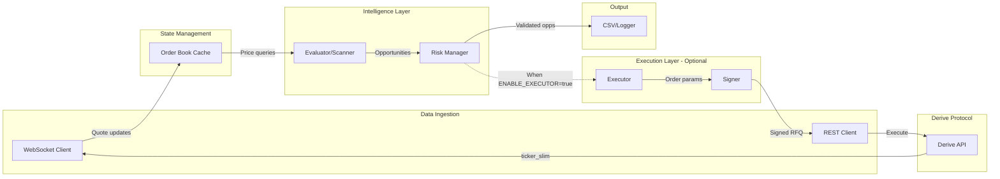
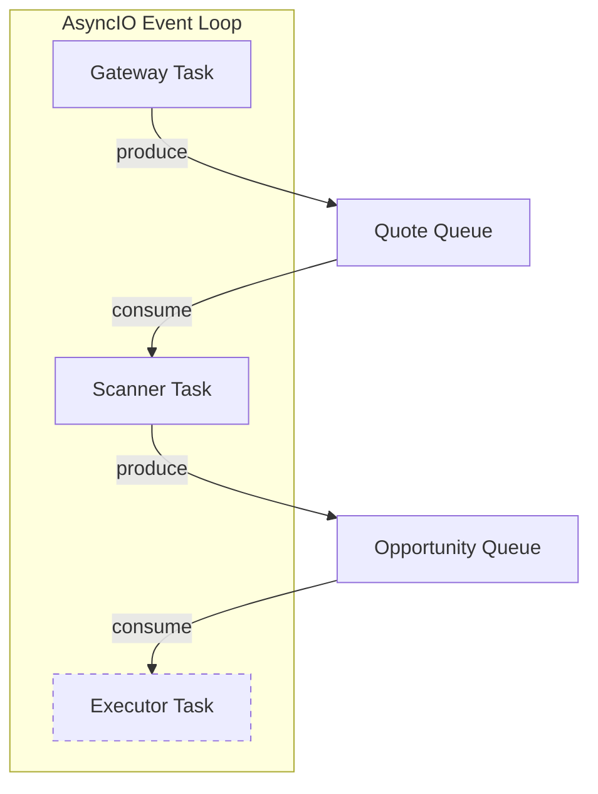
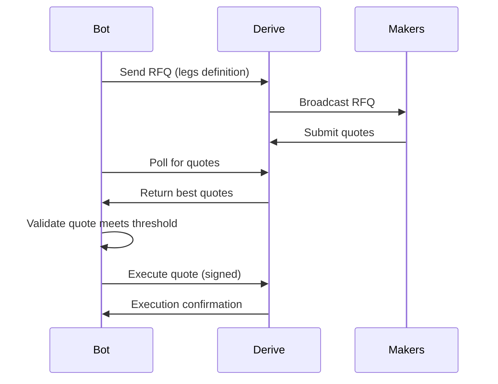

# Derive HFT Options Arbitrage Bot - Technical Specification

## Executive Summary

This document outlines the complete technical specification for a High-Frequency Trading (HFT) bot designed to exploit order book inefficiencies on the **Derive Protocol** (formerly Lyra). The bot's core philosophy is to identify and execute **deterministic, zero-cost or guaranteed-profit positions at Time 0 (t=0)** using live order book data.

### Core Philosophy

- **No Monte Carlo Simulations**: We do not simulate future price paths. If a trade requires probabilistic modeling to justify, it is not suitable for this system.
- **Deterministic Arbitrage**: Every opportunity must be mathematically provable at the moment of execution.
- **Zero-Loss Constraint**: No position is entered unless the worst-case outcome (asset price → $0) results in zero or positive P&L.
- **Order Book Inefficiencies**: Profit comes from mispricing between related instruments, not from directional speculation.

### Target Strategies

1. **Put-Call Parity Arbitrage** (Conversion/Reversal)
2. **Zero-Cost Collar** (Principal-Protected Long)
3. **Box Spread** (Risk-Free Interest Rate Capture)
4. **Negative-Cost Butterfly** (Credit Entry with Bounded Loss)

---

## 1. Financial Strategy Research

### 1.1 The Zero-Cost Philosophy

The fundamental goal is to find positions where:

$$\text{Premium Received} \geq \text{Premium Paid} + \text{All Fees}$$

This creates a "free" or "paid-to-enter" position with mathematically bounded downside.

### 1.2 Strategy A: Put-Call Parity Arbitrage (Conversion/Reversal)

**Theoretical Foundation**

The Put-Call Parity equation for European options states:

$$C - P = S - K \cdot e^{-rT}$$

Where:
- \( C \) = Call option premium
- \( P \) = Put option premium  
- \( S \) = Spot price of underlying
- \( K \) = Strike price
- \( r \) = Risk-free interest rate
- \( T \) = Time to expiry in years

**Arbitrage Mechanism**

If the market prices violate this relationship, a risk-free profit exists:

- **Conversion**: When \( C - P > S - K \cdot e^{-rT} \), calls are overpriced
  - Action: Sell Call + Buy Put + Buy Underlying
  - Locks in profit equal to the mispricing

- **Reversal**: When \( C - P < S - K \cdot e^{-rT} \), puts are overpriced
  - Action: Buy Call + Sell Put + Sell Underlying
  - Locks in profit equal to the mispricing

**Guaranteed Payoff**: Strike price \( K \) at expiry, regardless of where the underlying settles.

### 1.3 Strategy B: Zero-Cost Collar

**Position Composition**

- Long Underlying at price \( S_0 \)
- Long Put at strike \( K_P \) (protection floor)
- Short Call at strike \( K_C \) where \( K_C > K_P \) (premium generator)

**Zero-Cost Condition**

$$C_{K_C}^{bid} \geq P_{K_P}^{ask} + \text{Fees}$$

**Mathematical Proof of Floor**

- Net Entry Cost: \( \text{Cost} = S_0 + P - C \)
- Guaranteed Floor Value: \( K_P \) (put exercises if \( S_T < K_P \))
- Zero-Loss Condition: \( K_P \geq S_0 + P - C \)

Rearranged: \( C - P \geq S_0 - K_P \)

**Payoff Profile**

| Scenario | Outcome |
|----------|---------|
| \( S_T < K_P \) | Portfolio value = \( K_P \) (put exercises) |
| \( K_P \leq S_T \leq K_C \) | Portfolio value = \( S_T \) (both options expire worthless) |
| \( S_T > K_C \) | Portfolio value = \( K_C \) (call is assigned) |

**Key Insight**: When volatility skew causes OTM calls to be overpriced (negative skew), zero-cost collars become achievable with favorable floor-to-ceiling ratios.

### 1.4 Strategy C: Box Spread

**Position Composition**

- Bull Call Spread: Long Call \( K_1 \), Short Call \( K_2 \)
- Bear Put Spread: Long Put \( K_2 \), Short Put \( K_1 \)

**Guaranteed Payoff at Expiry**

$$\text{Payoff} = K_2 - K_1 \quad \forall S_T$$

This is independent of where the underlying settles - the box always pays the strike difference.

**Arbitrage Condition**

$$\text{Net Debit} < (K_2 - K_1) \cdot e^{-rT}$$

If we can enter for less than the present value of the guaranteed payoff, the difference is risk-free profit.

**Interest Rate Interpretation**: Box spreads effectively allow borrowing or lending at an implied rate. Arbitrage exists when the implied rate differs significantly from market rates.

### 1.5 Strategy D: Negative-Cost Butterfly

**Position Composition** (Call Butterfly)

- Long 1 Call at strike \( K_1 \)
- Short 2 Calls at strike \( K_2 \)
- Long 1 Call at strike \( K_3 \)

Where \( K_1 < K_2 < K_3 \) and strikes are equidistant: \( K_2 - K_1 = K_3 - K_2 \)

**Standard Butterfly**: Maximum loss equals the net debit paid at entry.

**Negative-Cost Butterfly**: If we receive a net credit to enter:
- Maximum loss = $0 (we already got paid)
- Maximum profit = Wing width + Credit received (at \( K_2 \))

**Arbitrage Condition**: Net cost to enter < 0 (credit received)

---

## 2. System Architecture

### 2.1 High-Level Data Flow



**Legend**: Dashed lines indicate optional paths (only active when `ENABLE_EXECUTOR=true`).

### 2.2 Event-Driven Architecture

The system operates on a **Reactive Data Flow** model:

1. **Ingestion**: WebSocket client receives raw JSON from Derive channels
2. **State Update**: Order book cache updates best bid/ask for all instruments
3. **Evaluation Trigger**: Every price update triggers the scanner
4. **Opportunity Detection**: Scanner calculates net cost of target structures
5. **Validation**: Risk manager proves zero-loss constraint
6. **Execution**: Atomic RFQ submission via REST

### 2.3 Concurrency Model



- **Gateway Task**: Maintains WebSocket connection, pushes quotes to queue
- **Scanner Task**: Consumes quotes, runs arbitrage detection, pushes opportunities
- **Executor Task** *(optional)*: Consumes opportunities, executes via RFQ. **Only started when `ENABLE_EXECUTOR=true`**

All tasks run concurrently in a single Python process using `asyncio`.

### 2.4 Observation Mode vs Execution Mode

The bot supports two operational modes controlled by `ENABLE_EXECUTOR`:

| Mode | `ENABLE_EXECUTOR` | Behavior |
|------|-------------------|----------|
| **Observation** | `false` (default) | Detects and logs opportunities without trading. No API keys required. |
| **Execution** | `true` | Full pipeline with live trade execution. Requires Session Key credentials. |

**Observation Mode** is ideal for:
- Validating strategy viability before deploying capital
- Research and backtesting
- Monitoring market conditions without risk

---

## 3. Technical Stack

### 3.1 Dependency Justification

| Dependency | Purpose | Justification |
|------------|---------|---------------|
| **websockets** | WebSocket connectivity | Lightweight, pure-Python, excellent async support |
| **aiohttp** | HTTP/REST requests | Non-blocking HTTP client for order execution |
| **eth-account** | EIP-712 signing | Required for Derive authentication and RFQ signatures |
| **orjson** (optional) | JSON parsing | 10x faster than stdlib json, critical for HFT |

### 3.2 Why Not Heavy Libraries?

| Avoided | Reason |
|---------|--------|
| **pandas** | DataFrame overhead destroys latency; simple dicts are faster |
| **numpy** | Unnecessary for basic arithmetic; adds GC pressure |
| **asyncpg/databases** | No database needed; all state is in-memory |
| **Flask/FastAPI** | No HTTP server needed; bot is a client only |

### 3.3 Performance Considerations

- **Global Interpreter Lock (GIL)**: Single-threaded async is actually optimal for I/O-bound HFT
- **Garbage Collection**: Minimize object creation; reuse data structures
- **Zero-Copy Principle**: Parse directly into target structures, avoid intermediate objects
- **Pre-allocation**: Update existing dict values rather than creating new dicts

---

## 4. Project File Structure

```
market-bot/
├── pyproject.toml          # Dependencies and project metadata
├── .env.example            # Environment variable template
├── README.md               # Project documentation
├── PLAN.md                 # This specification document
└── src/
    └── bot/
        ├── __init__.py     # Package marker
        ├── __main__.py     # Entry point (python -m bot)
        ├── config.py       # Configuration management
        ├── types.py        # Data structures
        ├── client.py       # WebSocket/REST gateway
        ├── orderbook.py    # In-memory state
        ├── evaluator.py    # Arbitrage scanner
        ├── risk.py         # Validation and proofs
        ├── executor.py     # RFQ execution (optional, requires ENABLE_EXECUTOR=true)
        └── main.py         # Orchestrator
```

### 4.2 Environment Configuration

**.env.example** structure:
```bash
# Required - API Endpoints
DERIVE_WS_URL=wss://api.derive.xyz/ws
DERIVE_REST_URL=https://api.derive.xyz

# Optional - Execution Mode (default: false)
ENABLE_EXECUTOR=false

# Required ONLY when ENABLE_EXECUTOR=true
# SESSION_KEY_PRIVATE=0x...
# SUBACCOUNT_ID=12345

# Optional - Trading Parameters
MIN_PROFIT_USD=1.00
MAX_QUOTE_AGE_MS=1000
```

### 4.1 Module Responsibilities

#### `config.py` - Configuration Management

**Scope**: Load and validate all configuration from environment variables.

**Responsibilities**:
- API endpoints (WebSocket URL, REST URL)
- **Execution mode flag** (`ENABLE_EXECUTOR`) - controls whether trades are executed
- Authentication credentials (Session Key private key) - **only required when `ENABLE_EXECUTOR=true`**
- Trading parameters (subaccount ID, min profit threshold) - **only required when `ENABLE_EXECUTOR=true`**
- Risk limits (max quote age, min trade size)

**Environment Variables**:
| Variable | Required | Description |
|----------|----------|-------------|
| `DERIVE_WS_URL` | Always | WebSocket endpoint |
| `DERIVE_REST_URL` | Always | REST API endpoint |
| `ENABLE_EXECUTOR` | No (default: `false`) | Enable live trade execution |
| `SESSION_KEY_PRIVATE` | When `ENABLE_EXECUTOR=true` | Session Key private key for signing |
| `SUBACCOUNT_ID` | When `ENABLE_EXECUTOR=true` | Trading subaccount ID |
| `MIN_PROFIT_USD` | No | Minimum profit threshold (default: $1.00) |
| `MAX_QUOTE_AGE_MS` | No | Maximum quote staleness (default: 1000ms) |

**Design**: Immutable dataclass, loaded once at startup, thread-safe. Validates that execution credentials are present only when `ENABLE_EXECUTOR=true`.

---

#### `types.py` - Data Structures

**Scope**: Define all domain objects used throughout the application.

**Responsibilities**:
- `Quote`: Market data snapshot (bid, ask, IV, Greeks, timestamp)
- `Opportunity`: Detected arbitrage with legs, fees, guaranteed P&L
- `Leg`: Single trade instruction (instrument, side, price, size)
- `ArbType`: Enumeration of strategy types

**Design**: Use `__slots__` for memory efficiency; immutable where possible.

---

#### `client.py` - Network Gateway

**Scope**: All communication with Derive Protocol.

**Responsibilities**:
- Establish and maintain WebSocket connection
- Handle authentication via Session Keys (EIP-712 signatures)
- Subscribe to `ticker_slim` channels for all instruments
- Parse incoming messages and push to quote queue
- Implement reconnection with exponential backoff
- Respect rate limits (150 req/sec for traders)

**Design**: Single class managing both WebSocket stream and REST calls.

---

#### `orderbook.py` - State Management

**Scope**: Maintain real-time market state in memory.

**Responsibilities**:
- Store latest quote for each instrument
- Provide O(1) lookup by instrument name
- Track quote freshness (timestamp)
- Signal evaluator on updates

**Design**: Dictionary-based cache with instrument name as key.

---

#### `evaluator.py` - Arbitrage Scanner

**Scope**: The mathematical brain of the system.

**Responsibilities**:
- Scan for Put-Call Parity violations (Conversions/Reversals)
- Scan for Zero-Cost Collar opportunities
- Scan for Box Spread arbitrage
- Scan for Negative-Cost Butterfly spreads
- Calculate gross profit/loss for each structure
- Estimate total fees including RFQ discounts
- Filter by minimum profit threshold

**Design**: Pure functions that query orderbook state; no side effects.

---

#### `risk.py` - Risk Manager

**Scope**: Final validation before execution.

**Responsibilities**:
- Prove zero-loss constraint mathematically
- Validate quote freshness (reject stale quotes)
- Validate liquidity (sufficient size at quoted price)
- Validate margin impact (won't trigger liquidation)
- Reject opportunities below profit threshold after fees

**Design**: Gatekeeper pattern; returns ValidationResult with pass/fail and reason.

---

#### `executor.py` - Order Execution *(Optional Module)*

**Scope**: Convert opportunities into executed trades. **Only active when `ENABLE_EXECUTOR=true`.**

**Responsibilities**:
- Construct RFQ payloads for multi-leg trades
- Sign RFQ requests using Session Key
- Submit via REST API
- Poll for maker quotes
- Execute best quote atomically
- Handle partial fills and failures

**Design**: Uses Derive's RFQ system for guaranteed atomic multi-leg execution.

**Disabled Behavior**: When `ENABLE_EXECUTOR=false`, this module is not initialized. Opportunities are logged to CSV/stdout for analysis instead of being executed.

---

#### `main.py` - Orchestrator

**Scope**: Application lifecycle management.

**Responsibilities**:
- Initialize all components
- Set up asyncio queues for inter-task communication
- Launch concurrent tasks (gateway, scanner, and optionally executor)
- **Conditionally start executor** based on `ENABLE_EXECUTOR` flag
- Handle graceful shutdown on SIGINT/SIGTERM

**Design**: Single async entry point using `asyncio.gather()`.

**Startup Logic**:
```python
tasks = [gateway_task, scanner_task]
if config.enable_executor:
    tasks.append(executor_task)
await asyncio.gather(*tasks)
```

---

## 5. Derive API Integration

### 5.1 Authentication

**Note**: Authentication is **only required when `ENABLE_EXECUTOR=true`**. In observation mode, the bot uses public WebSocket channels which do not require authentication.

Derive uses **Session Keys** for programmatic access:

1. Generate an Ethereum wallet (the Session Key)
2. Register it with your main wallet via the Derive UI or API
3. Sign requests using EIP-712 typed data signatures
4. Include wallet address, timestamp, and signature in login request

**Login Flow** (Execution Mode only):
1. Connect WebSocket to `wss://api.derive.xyz/ws`
2. Call `public/login` with signed timestamp
3. Receive authentication confirmation
4. Subscribe to private channels

**Observation Mode**: Skip authentication, subscribe only to public `ticker_slim` channels.

### 5.2 Real-Time Data Channels

| Channel | Data | Update Frequency |
|---------|------|------------------|
| `ticker_slim.{instrument}.100ms` | Best bid/ask, mark price, IV, Greeks | 100ms |
| `orderbook.{instrument}.1.10` | Top 10 price levels | On change |
| `{subaccount_id}.orders` | Order status updates | On change |
| `{subaccount_id}.trades` | Fill notifications | On fill |

**Instrument Naming Convention**: `{UNDERLYING}-{EXPIRY}-{STRIKE}-{TYPE}`

Example: `ETH-20260401-3500-C` = ETH Call, April 1 2026 expiry, $3500 strike

### 5.3 RFQ Execution Flow



**Key Benefit**: RFQ guarantees atomic execution - all legs fill or none do, eliminating "legging risk."

### 5.4 Rate Limits

| Account Type | Limit |
|--------------|-------|
| Trader | 150 requests/second |
| Market Maker | 2000 requests/second |

Implement token bucket rate limiting to stay within bounds.

---

## 6. Fee Structure Analysis

### 6.1 Derive Fee Schedule

| Product | Maker Fee | Taker Fee |
|---------|-----------|-----------|
| **Spot** | 0.02% | 0.05% |
| **Perpetuals** | $0.00 + 0.02% | $0.10 + 0.03% |
| **Options** | $0.00 + 0.02% | $0.50 + 0.03% |

### 6.2 RFQ Fee Discounts

Multi-leg trades via RFQ receive significant discounts:

- **Cheapest leg**: 100% fee discount (free)
- **2nd cheapest leg**: 50% fee discount
- **3rd cheapest leg**: 50% fee discount
- **Remaining legs**: Full fee

**Example**: 4-leg box spread
- Leg 1 (cheapest): $0.00
- Leg 2: 50% of normal
- Leg 3: 50% of normal
- Leg 4: Full fee

### 6.3 Special Box Spread Fee

Derive charges a special fee for box spreads:

$$\text{Box Fee} = 1\% \times \text{Notional} \times \text{Years to Expiry}$$

This must be included in all box spread profitability calculations.

### 6.4 L2 Gas Costs

Derive runs on an Optimism-based L2 chain:
- Typical transaction: $0.002 - $0.02
- Include ~$0.01 per leg as conservative estimate

---

## 7. Mathematical Validation Framework

### 7.1 Core Invariant

Every opportunity must satisfy before execution:

$$\text{Guaranteed Floor Value} \geq \text{Total Capital Deployed}$$

### 7.2 Validation Checklist

| Check | Condition | Rejection Reason |
|-------|-----------|------------------|
| **Freshness** | `now - quote_timestamp < max_age_ms` | STALE_QUOTE |
| **Liquidity** | `available_size >= min_trade_size` | INSUFFICIENT_LIQUIDITY |
| **Net Profit** | `gross_profit - fees >= min_profit_usd` | BELOW_THRESHOLD |
| **Zero-Loss** | `guaranteed_floor >= entry_cost` | NEGATIVE_FLOOR |
| **Fee Coverage** | `gross_credit > total_fees` | FEE_EXCEEDS_PROFIT |
| **Margin** | `IMR < available_collateral` | MARGIN_BREACH |

### 7.3 Strategy-Specific Proofs

**Conversion/Reversal**:
- Entry: \( S_0 + P_{ask} - C_{bid} \)
- Floor: \( K \) (guaranteed at expiry)
- Profit: \( K - (S_0 + P_{ask} - C_{bid}) \)

**Zero-Cost Collar**:
- Entry: \( S_0 + P_{ask} - C_{bid} \)
- Floor: \( K_P \)
- Zero-loss when: \( K_P \geq S_0 + P_{ask} - C_{bid} \)

**Box Spread**:
- Entry: \( C_1^{ask} - C_2^{bid} + P_2^{ask} - P_1^{bid} \)
- Payoff: \( K_2 - K_1 \) (certain)
- Profit: \( (K_2 - K_1) \cdot e^{-rT} - \text{Entry} - \text{BoxFee} \)

---

## 8. Risk Management

### 8.1 Quote Staleness

In fast-moving markets, quotes become stale quickly. Configure maximum acceptable quote age:
- Recommended: 500ms - 1000ms
- Reject any opportunity with older quotes

### 8.2 Liquidity Risk

Quoted prices are only valid for the displayed size. Validate:
- All legs have sufficient `available_size`
- Use minimum across all legs as maximum tradeable size

### 8.3 Execution Risk

Even with RFQ atomic execution, risks remain:
- **Quote Expiry**: Maker quotes have limited validity windows
- **Network Latency**: Time between detection and execution
- **Slippage**: Large orders may not fill at expected prices

Mitigation: Set conservative profit thresholds that absorb reasonable slippage.

### 8.4 Margin Risk

Derive's Portfolio Margin evaluates positions under 23 stress scenarios. Ensure:
- Hedged positions receive proper margin offset
- Available collateral exceeds Initial Margin Requirement (IMR)
- Buffer for market volatility

---

## 9. Implementation Roadmap

### Phase 1: Passive Observer (Research Mode)

**Objective**: Validate strategy viability without risking capital.

**Configuration**: `ENABLE_EXECUTOR=false` (default) - no API keys required.

**Deliverables**:
- Working WebSocket connection to Derive (public channels only)
- Real-time order book state management
- Scanner logging all detected opportunities
- CSV output with: timestamp, strategy type, legs, gross profit, fees, net profit

**Success Criteria**: Identify >10 opportunities per day with >$1 theoretical profit.

---

### Phase 2: Validator (Risk Mode)

**Objective**: Ensure mathematical proofs are bulletproof.

**Deliverables**:
- Complete risk manager implementation
- Margin simulation integration
- Backtesting against historical opportunity log
- Stress testing with extreme market scenarios

**Success Criteria**: Zero false positives (opportunities that would have lost money).

---

### Phase 3: Striker (Execution Mode)

**Objective**: Live trading with real capital.

**Configuration**: `ENABLE_EXECUTOR=true` - requires `SESSION_KEY_PRIVATE` and `SUBACCOUNT_ID`.

**Deliverables**:
- Session Key authentication
- RFQ execution pipeline
- Real-time P&L tracking
- Alerting on errors/failures

**Success Criteria**: Profitable execution with <1% failed trades.

---

## 10. Performance Targets

| Metric | Target |
|--------|--------|
| Quote-to-Evaluation Latency | < 10ms |
| Opportunity-to-Execution Latency | < 100ms |
| Memory per Quote | < 500 bytes |
| Max Concurrent Subscriptions | 500 instruments |
| Reconnection Time | < 5 seconds |

---

## 11. Monitoring & Observability

### 11.1 Key Metrics

- Opportunities detected per minute
- Opportunities validated vs rejected (by reason)
- Execution success rate
- Average profit per trade
- Total P&L (daily, weekly, monthly)

### 11.2 Alerting

- WebSocket disconnection
- Authentication failure
- Execution errors
- Margin warnings
- Rate limit approaching

### 11.3 Logging

Asynchronous, non-blocking logging to prevent latency impact:
- INFO: Opportunities detected and executed
- WARN: Validation rejections, reconnections
- ERROR: Execution failures, API errors

---

## 12. Security Considerations

### 12.1 Key Management

- Session Key private key stored in environment variable
- **Only required when `ENABLE_EXECUTOR=true`** - observation mode needs no credentials
- Never logged or exposed in error messages
- Scoped permissions (trade only, no withdraw)
- Config validation fails fast if executor is enabled but credentials are missing

### 12.2 Network Security

- WebSocket over TLS (wss://)
- REST over HTTPS
- No sensitive data in URLs

### 12.3 Operational Security

- Run on dedicated, secured infrastructure
- Limit API key permissions
- Monitor for unauthorized access

---

## References

- [Derive API Documentation](https://docs.derive.xyz/reference/overview)
- [Put-Call Parity - Investopedia](https://www.investopedia.com/terms/p/putcallparity.asp)
- [Box Spread Arbitrage](https://www.optionstrading.org/strategies/arbitrage/box-spread/)
- [EIP-712 Typed Data Signing](https://eips.ethereum.org/EIPS/eip-712)

---

*Document Version: 1.0*  
*Last Updated: March 2026*
